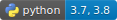

# Overview

This repo is an experiment to build a reliable parser for UK addresses by utilising the Royal Mail PAF dataset.
It's inspired by the [address-net project](https://github.com/jasonrig/address-net) and uses some of the same
techniques to predict the class of address components to which each character in the address
string belongs. In the next sections we will cover the various scripts available for sampling, preprocessing,
training and parsing using a trained model, as well as example usages using a pre-trained RNN model.

# Note on data and the models

The models in this repo are trained on the Postcode Address File. See [PAF documentation](https://www.poweredbypaf.com/product/paf/)
for more details. To train your own models, you will need to arrange access to this data and purchase it. We don't provide
any of the PAF data in this repo due to distribution restrictions. However, we do provide pre-trained models in this repo
under `pretrained/`.

Now we will walk through the various components of this repo.

# Components

### Sampling

The `sample.py` script takes in a input path to the full PAF file and output path to a sample output and produces
a sample of the records specified by some proportion. For the models we trained we sampled 2%, which is ~600K addresses.

### Pre-processing

This is optional in case you want to save the pre-processed/transformed data. The `preprocess.py` script performs the following

- Standardise casing to lower case.
- Introduces some noise in the data. This is in the form of shuffling address components to have a variety of different
address structures, as well as removing some address components at random. Since we're constructing a training set programmatically,
it's important that we try and introduce as much variation to try and capture various forms of addresses that a human would
possibly write.
- Split each address component string into a list of tuples of `(<char>, <label>)`. The ML model we're using is a character-level
RNN so we need to construct a character-level representation to be fed to the network.
- Map characters and labels to integer representations, thus finalising the preprocessing step.

### Training

The `train.py` script performs both the pre-processing step described earlier as well as the training. The reason for this is
we found the pre-processing step was fairly quick compared to training so it allowed for rapid iteration to make tweaks on both
the pre-processing logic and modeling simultaneously without having to run two separate scripts. In the future we might refactor
the code to make pre-processing happen strictly in the preprocess script for better separation of concerns.

The training process follows a standard Deep Learning workflow for training a RNN. The model we used is a bi-directional
LSTM with a preceding embedding layer, trained on batches of preprocessed data. Outputs of the LSTM layers are flattened and then
passed through a fully connected linear layer to produce a distribution of logit scores over address classes for each character in a given batch.

Training loss and accuracy are reported throughout the training process.

### Prediction

A `predict.py` script is provided that can be used with a CSV file containing a single column of address lines. This script
parses the provided addresses into the address components and returns the original address along with the parsed components.

# Using pre-trained model

As you can't train this model without access to the PAF data, we provide a pre-trained model that you can use to extract
structure from a simple address string. Pretrained models are under the `pretrained/` dir and you can use them as shown below

```python
>>> import torch
>>> from address_parser.rnn.util import parse_raw_address
>>> model = torch.load("./pretrained/address_rnn.pt")

>>> parse_raw_address("25 Christopher street, moorgate, london, eC2a 2bs, uk", model)
defaultdict(<class 'str'>, {'building_number': '25', 'separator': ' , , , ,', 'thoroughfare_and_descriptor': 'christopher street', 'dependent_locality': 'moorgate', 'posttown': 'london', 'postcode': 'ec2a 2bs'})

>>> parse_raw_address("165 Fleet Street, London EC4A 2DY", model)  # No country
defaultdict(<class 'str'>, {'building_number': '165', 'separator': ' ,  ', 'thoroughfare_and_descriptor': 'fleet street', 'posttown': 'london', 'postcode': 'ec4a 2dy', 'padding': '|||||||||||||||||'})

>>> parse_raw_address("165 Fleet Street, London EC4A2DY", model)  # No space in postcode
defaultdict(<class 'str'>, {'building_number': '165', 'separator': ' ,  ', 'thoroughfare_and_descriptor': 'fleet street', 'posttown': 'london', 'postcode': 'ec4a2dy', 'padding': '||||||||||||||||||'})

>>> parse_raw_address("165 Fleet Street, EC4A2DY", model)  # No posttown
defaultdict(<class 'str'>, {'building_number': '165', 'separator': ' , ', 'thoroughfare_and_descriptor': 'fleet street', 'postcode': 'ec4a2dy', 'padding': '|||||||||||||||||||||||||'})

>>> parse_raw_address("The Gherkin, London EC3A 8BF", model) # No number or street name 
defaultdict(<class 'str'>, {'thoroughfare_and_descriptor': 'the gherkin', 'separator': ',  ', 'posttown': 'london', 'postcode': 'ec3a 8bf', 'padding': '||||||||||||||||||||||'})
```

so you can see that this model is capable of dealing with a good range of variation in the address structure. There are however
some limitations and potential improvements that can be done and they are explained in the next section

# TODOs and improvements

- Injecting some variations of common words such as street, st, st., road, rd etc to make the training process more robust
to variations.
- Introducing typos in some examples using neighbouring character mapping (which is done in address-net).
- Experimenting with different network architectures (for example using GRU layers) as well as different hyperparameters.


# NOTE on usage

This is an open source project licensed under MIT license. Anyone is free to use this software for personal or commercial purposes,
including the pretrained models supplied. This repo won't expose any of the data used in training due to distribution restrictions.
The scripts for sampling, pre-processing and training should be usable out-of-the-box with the PAF address file for users who have
access to the data. See [here](https://www.poweredbypaf.com/product/paf/) for more details on PAF data and how you can
get access to it.
